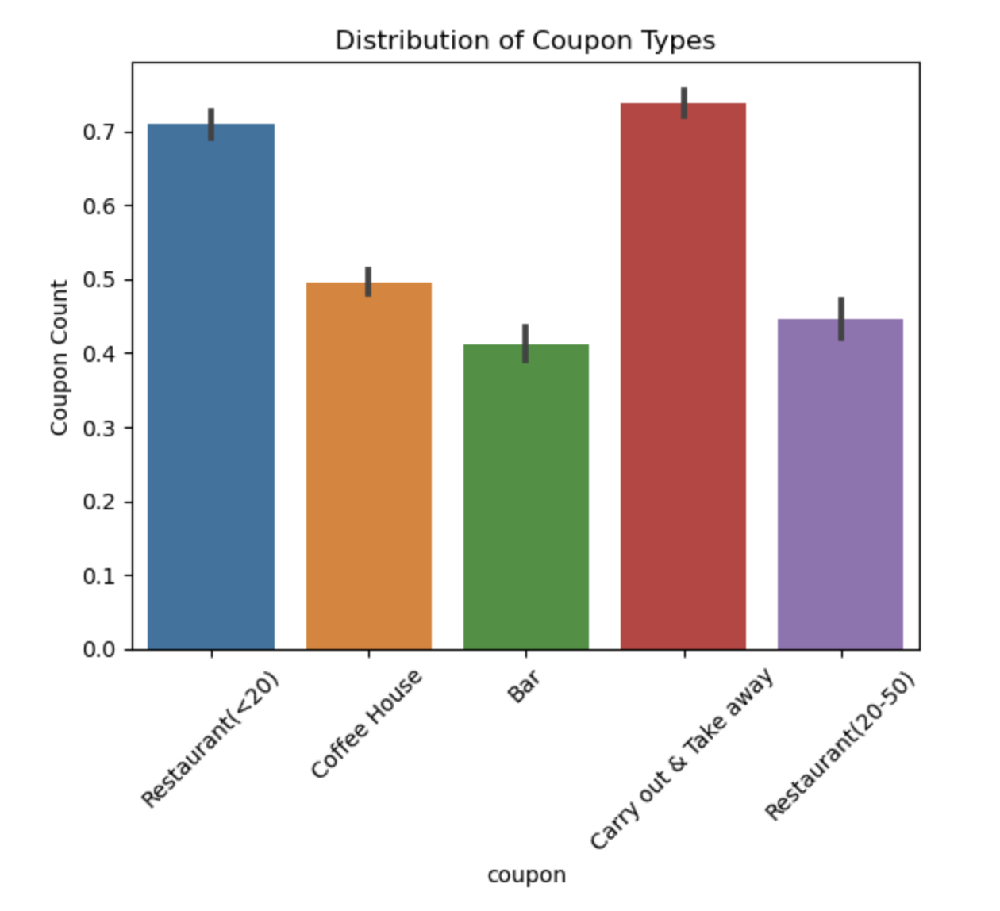
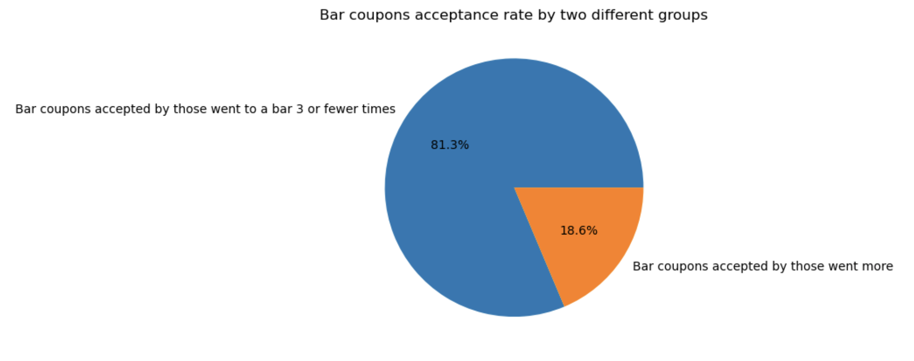
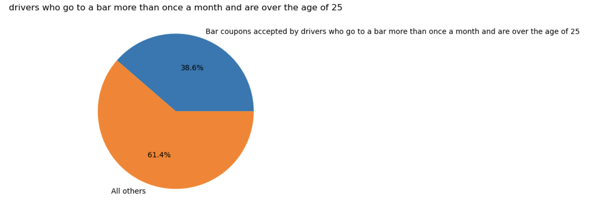
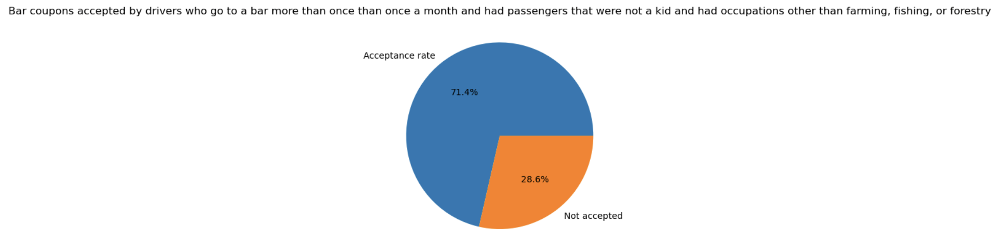
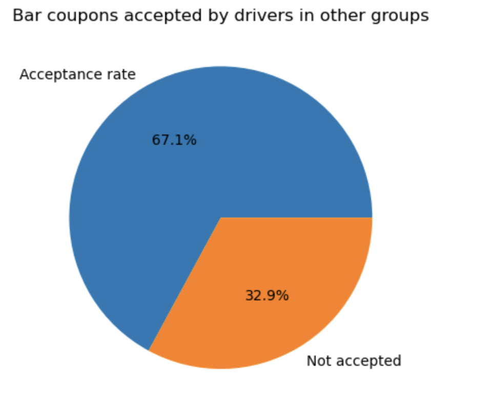
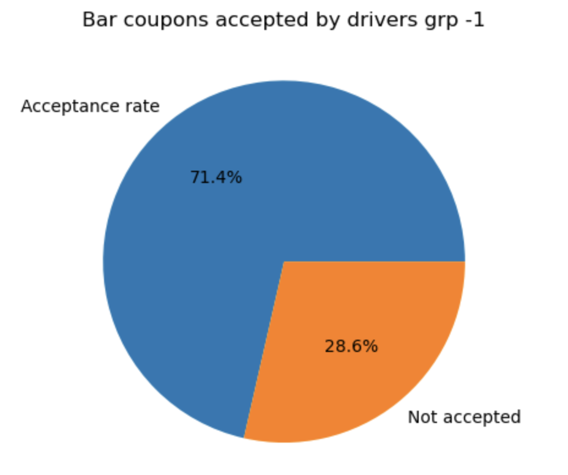
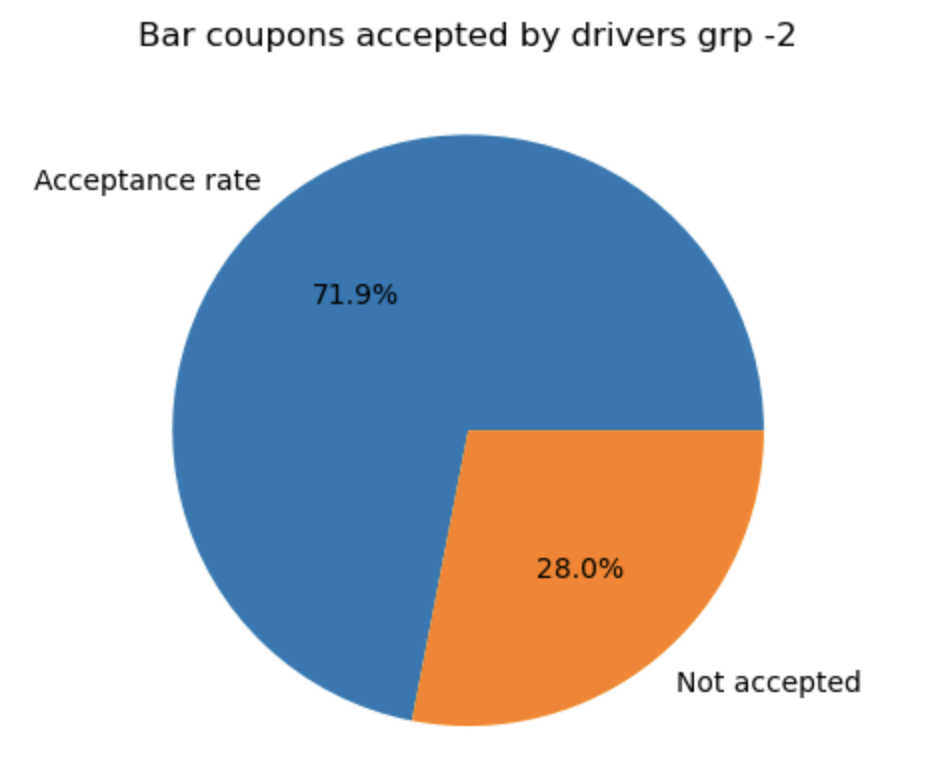
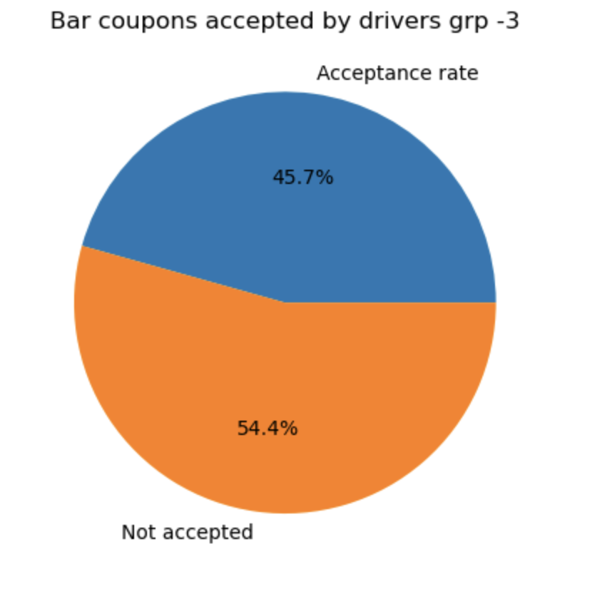

# Readme file for Practical Application Assignment 5.1: Will the Customer Accept the Coupon?

### Problem:

**Context**
Imagine driving through town and a coupon is delivered to your cell phone for a restaraunt near where you are driving. Would you accept that coupon and take a short detour to the restaraunt? Would you accept the coupon but use it on a sunbsequent trip? Would you ignore the coupon entirely? What if the coupon was for a bar instead of a restaraunt? What about a coffee house? Would you accept a bar coupon with a minor passenger in the car? What about if it was just you and your partner in the car? Would weather impact the rate of acceptance? What about the time of day?
Obviously, proximity to the business is a factor on whether the coupon is delivered to the driver or not, but what are the factors that determine whether a driver accepts the coupon once it is delivered to them? How would you determine whether a driver is likely to accept a coupon?

**Overview**
The goal of this project is to use what you know about visualizations and probability distributions to distinguish between customers who accepted a driving coupon versus those that did not.

**Data**
This data comes to us from the UCI Machine Learning repository and was collected via a survey on Amazon Mechanical Turk. The survey describes different driving scenarios including the destination, current time, weather, passenger, etc., and then ask the person whether he will accept the coupon if he is the driver. Answers that the user will drive there ‘right away’ or ‘later before the coupon expires’ are labeled as ‘Y = 1’ and answers ‘no, I do not want the coupon’ are labeled as ‘Y = 0’. There are five different types of coupons -- less expensive restaurants (under $20), coffee houses, carry out & take away, bar, and more expensive restaurants ($20 - $50).

### Data Description
Keep in mind that these values mentioned below are average values.
The attributes of this data set include:

**User attributes**
1. Gender: male, female
2. Age: below 21, 21 to 25, 26 to 30, etc.
3. Marital Status: single, married partner, unmarried partner, or widowed
4. Number of children: 0, 1, or more than 1
5. Education: high school, bachelors degree, associates degree, or graduate degree
6. Occupation: architecture & engineering, business & financial, etc.
7. Annual income: less than $12500, $12500 - $24999, $25000 - $37499, etc.
8. Number of times that he/she goes to a bar: 0, less than 1, 1 to 3, 4 to 8 or greater than 8
9. Number of times that he/she buys takeaway food: 0, less than 1, 1 to 3, 4 to 8 or greater than 8
10. Number of times that he/she goes to a coffee house: 0, less than 1, 1 to 3, 4 to 8 or greater than 8
11. Number of times that he/she eats at a restaurant with average expense less than $20 per person: 0, less than 1, 1 to 3, 4 to 8 or greater than 8
12. Number of times that he/she goes to a bar: 0, less than 1, 1 to 3, 4 to 8 or greater than 8

**Contextual attributes**
1. Driving destination: home, work, or no urgent destination
2. Location of user, coupon and destination: we provide a map to show the geographical location of the user, destination, and the venue, and we mark the distance between each two places with time of driving. The user can see whether the venue is in the same direction as the destination.
3. Weather: sunny, rainy, or snowy
4. Temperature: 30F, 55F, or 80F
5. Time: 10AM, 2PM, or 6PM
6. Passenger: alone, partner, kid(s), or friend(s)

**Coupon attributes**
1. time before it expires: 2 hours or one day

### (I) Initial Setup and Data Set Cleanup / Transformation

I have used below steps and performed some cleanup and transformation on data set as listed out below:
1. Read csv data set into data frame.
2. Checked data set and missing or incorrect values
3. Performed correction to correct misspelled data values in the data set.
4. Performed cleanup to drop column(s) those have very high number of missing valies
5. Performed cleanup to drop few record where values were missing
6. Verified cleaned and transformed data set to ensure no further missing or incorrect values in the data set for further analysis.

### (II) Initial Data Analysis
 I have performed some initial analysis to see how different coupons are distributed as per their overall acceptance.

 **Observation** - Proportion of the total accepted coupon: 56.93%

**Visualization based on different types of the coupon**

### (III) Bar Coupon Analysis
 I have performed analysis on the Bar Coupons as mentioned in the problem and below are the key observations:

**(a) What proportion of bar coupons were accepted?**
Proportion of bar coupons accepted out of total bar coupons: 41.19

**(b) Compare the acceptance rate between those who went to a bar 3 or fewer times a month to those who went more**
Proportion of bar coupons accepted by those went to a bar 3 or fewer times : 81.35%
Proportion of bar coupons accepted by those went more : 18.65%

**(c) Compare the acceptance rate between drivers who go to a bar more than once a month and are over the age of 25 to the all others.**
Proportion of bar coupons accepted by drivers who go to a bar more than once a month and are over the age of 25 : 38.61%

**(d) Use the same process to compare the acceptance rate between drivers who go to bars more than once a month and had passengers that were not a kid and had occupations other than farming, fishing, or forestry.**
Proportion of bar coupons accepted by drivers who go to a bar more than than once a month and had passengers that were not a kid and had occupations other than farming, fishing, or forestry : 71.43%

Proportion of bar coupons accepted by other drivers group : 67.1%

**(e) Acceptance rates between those drivers who - go to bars more than once a month, had passengers that were not a kid, and were not widowed**
Proportion of bar coupons accepted by this drivers group : 71.43%

**(f) Acceptance rates between those drivers who - go to bars more than once a month and are under the age of 30**
Proportion of bar coupons accepted by this drivers group : 71.95%

**(g) Acceptance rates between those drivers who - go to cheap restaurants more than 4 times a month and income is less than 50K**
Proportion of bar coupons accepted by this drivers group : 45.65%

